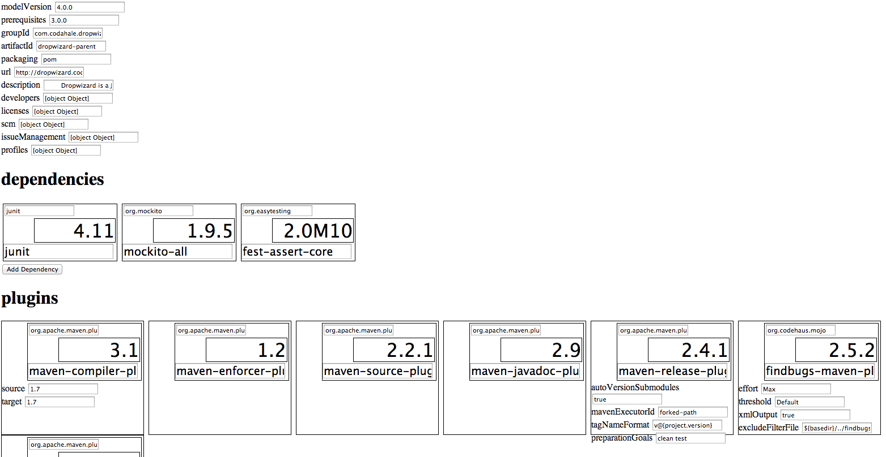

POM Editor
===

POM Editor is a simple web based interface for visualising and editing POM files. The interface is entirely in Javascript, there is no backend server except for a proxy used to get around CORS when reading pom.xml files.

The template for any XML element can be customized.




# Libraries Used

 * Knockout
 * Underscore
 * jQuery
 * JQuery Masonry
 
# Architecture

 * The POM is fetched by an AJAX call and returned as a `document fragment`.
 * **XML to JSON**: The fragment's DOM is walked via jQuery and converted to JSON.
 * Create another JSON object where each field corresponds to the original XML fragment.
 * **Observable ViewModels**: The Knockout mapping plugin creates observables for each field in the POM.
 * **Synchronizing the ViewModels with the XML** Knockout `Subscriptions` are added to each observable so that whenever the observable changes the corresponding XML fragment is also updated.
 * **Input fields** Knockout `value` bindings keep the ViewModel up to date. This means that the whenever input fields change, the observable POM XML representation of the POM synchronized in memory.  
 * **Rendering** The Knockout `template` binding is used dynamically to walk the project model.
 * jQuery Masonry lines each element in a grid.
 * Exporting the updated POM can be done with `XMLSerializer`.
 * **Adding New Content** Adding new content to the POM (such as dependencies or plugins) is accomplished by cloning XML fragments and using the same JSON conversion and mapping in the same process above. 
 
# Setup

You will need Nginx and Python installed.

1. Clone and change to the repository.
1. Link the nginx config file. `ln -s $(pwd)/pomeditor.conf /usr/local/etc/nginx/pomeditor.conf`
1. Run `nginx -c /usr/local/etc/nginx/pomeditor.conf`
1. Start nginx with `nginx`

# Usage

1. Go to a directory with a pom in it and run `python -mSimpleHTTPServer 8001`
2. Go to http://localhost:9001/
3. You will now see the POM file. If you change it, the updated XML will appear on the Javascript console.
 
# ToDo

* Poll or detect external changes to the original POM file and reflect the changes onscreen.
* Being able to detect XML structures like this. POM Editor cannot tell that this is an XML element that contains a list of Developer elements. I think this will require redoing the XML -> JSON serialization.

```
<developers>
<developer>
	...
</developer>
</developers>
```

